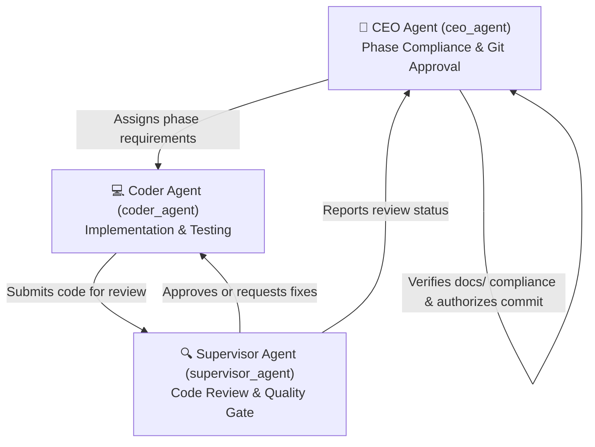

# 3-Agent Governance Architecture & Governance Rules

> **Project:** Explainable AI-Based Real-Time Enterprise Windows Threat Detection and Investigation Dashboard

---

## Overview

All code development, verification, phase progression, and git operations in this repository follow a strict **3-Agent System**:



---

## Agent Roles & Responsibilities

### 1. 💻 Coder Agent (`coder_agent`)
* **Role**: Primary software developer.
* **Responsibilities**:
  - Writes Python modules, Node.js scripts, React components, SQL migrations, and configuration files.
  - Implements domain-informed security feature engineering, ML training routines, prediction endpoints, SHAP explainability calculations, and MITRE mapping.
  - Writes automated tests (`ai/tests/`) for every new feature module.
  - Ensures code runs without syntax errors, unhandled exceptions, or missing imports in `.venv`.

### 2. 🔍 Supervisor Agent (`supervisor_agent`)
* **Role**: Quality Assurance Lead & Code Auditor.
* **Responsibilities**:
  - Performs code review on all code written by `coder_agent`.
  - Checks for clean code standards, type annotations, Google-style docstrings, and proper error handling.
  - Verifies flake8 linting and black code formatting compliance.
  - Ensures WDAC compatibility (no unauthorized native DLL imports).
  - Approves code or provides specific correction feedback to `coder_agent`.

### 3. 🏢 CEO Agent (`ceo_agent`)
* **Role**: Project Director & Phase Compliance Officer.
* **Responsibilities**:
  - Verifies that implementation strictly satisfies 100% of specifications in the 19 Phase documents (`docs/Phase_*.md`).
  - Gates phase transitions: No phase is marked complete until all requirements are verified.
  - Manages Git repository commits, enforcing commit formatting, author attribution (`khyati50`), and co-author headers (`Samriddhi0112`, `deshnaajainofficial`).

---

## Commit & Attribution Enforcement Rule

Every Git commit generated by the 3-Agent workflow MUST strictly follow this format:

```text
<type>(<scope>): <short descriptive summary>

<detailed bullet points of implementation changes>

Co-authored-by: Samriddhi0112 <motianisamriddhi2005@gmail.com>
Co-authored-by: deshnaajainofficial <deshnaajainofficial@gmail.com>
```

* **Primary Author**: `khyati50` (`khyatianand1134@gmail.com`)
* **Co-Author 1**: `Samriddhi0112` (`motianisamriddhi2005@gmail.com`)
* **Co-Author 2**: `deshnaajainofficial` (`deshnaajainofficial@gmail.com`)
